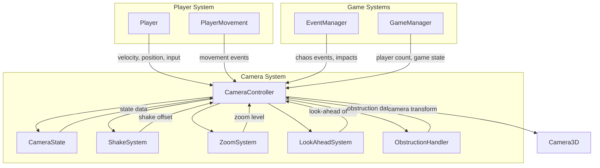
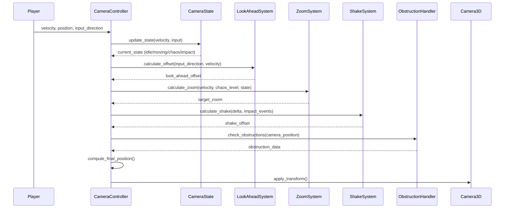

# Top-Down Angled Camera System Design Document

## Table of Contents
1. [System Architecture Overview](#system-architecture-overview)
2. [Component Specifications](#component-specifications)
3. [Parameter Tuning Guide](#parameter-tuning-guide)
4. [Integration Plan](#integration-plan)
5. [Implementation Priority](#implementation-priority)

---

## System Architecture Overview

### High-Level Component Diagram



### Data Flow Between Components



### Integration Points with Existing Player System

| Integration Point | Description | Required Changes |
|-------------------|-------------|------------------|
| Player.gd | Camera reference for movement | Update camera reference to new system |
| Player.tscn | Camera node structure | Replace PlayerCamera with new camera rig |
| Input System | Movement direction input | Pass input direction to camera |
| Event System | Impact/chaos events | Add event bus for camera feedback |

---

## Component Specifications

### 1. CameraController Class

**Purpose**: Main orchestrator for all camera behavior, coordinates all subsystems.

**File**: `GAME/game-files/script/camera/camera_controller.gd`

**Class Structure**:
```gdscript
extends Node3D
class_name CameraController

# References
@onready var camera: Camera3D = $Camera3D
var player: CharacterBody3D
var state: CameraState
var shake_system: ShakeSystem
var zoom_system: ZoomSystem
var look_ahead_system: LookAheadSystem
var obstruction_handler: ObstructionHandler

# Core Parameters
@export_group("Core Follow")
@export var follow_speed: float = 8.0
@export var follow_damping: float = 0.9
@export var screen_bias_y: float = 0.15  # Player position bias below center

@export_group("Camera Angle")
@export var tilt_angle: float = 35.0  # Degrees from horizontal
@export var fixed_rotation: float = 0.0  # Y-axis rotation (locked)

@export_group("Velocity Lag")
@export var velocity_lag_strength: float = 0.3
@export var lag_catchup_speed: float = 12.0
@export var micro_acceleration_smoothing: float = 0.15

# Internal State
var current_position: Vector3
var target_position: Vector3
var velocity_lag_offset: Vector3
var accumulated_velocity: Vector3
var idle_drift_offset: Vector3
var idle_drift_time: float = 0.0

# Methods
func _ready()
func _physics_process(delta: float)
func set_player_target(player_node: CharacterBody3D)
func update_follow(delta: float)
func apply_velocity_lag(delta: float)
func apply_idle_drift(delta: float)
func compute_final_position() -> Vector3
func apply_camera_transform()
func trigger_impact_feedback(intensity: float)
func set_chaos_level(level: float)
```

**Key Methods**:

- `update_follow(delta)`: Smoothly follows player with configurable damping
- `apply_velocity_lag(delta)`: Creates elastic trailing effect based on player velocity
- `apply_idle_drift(delta)`: Adds subtle breathing motion when player is idle
- `compute_final_position()`: Combines all offsets (follow, lag, look-ahead, shake, drift)
- `trigger_impact_feedback(intensity)`: Called on hits/landings for micro-zoom impulse

---

### 2. CameraState Management

**Purpose**: Manages camera states and transitions between idle, moving, chaos, and impact states.

**File**: `GAME/game-files/script/camera/camera_state.gd`

**Enum Definition**:
```gdscript
enum CameraStateType {
    IDLE,       # Player stationary, minimal movement
    MOVING,     # Player moving normally
    CHAOS,      # High activity, multiple players/events
    IMPACT      # Momentary impact feedback
}
```

**Class Structure**:
```gdscript
extends RefCounted
class_name CameraState

var current_state: CameraStateType = CameraStateType.IDLE
var previous_state: CameraStateType = CameraStateType.IDLE
var state_time: float = 0.0
var transition_progress: float = 0.0

# State thresholds
@export var idle_velocity_threshold: float = 0.1
@export var chaos_player_count: int = 3
@export var chaos_distance_threshold: float = 15.0
@export var impact_duration: float = 0.3

# Methods
func update_state(player_velocity: Vector3, nearby_players: int, chaos_events: int)
func get_state_weight() -> Dictionary
func is_in_transition() -> bool
func get_transition_factor() -> float
```

**State Behaviors**:

| State | Follow Speed | Look-Ahead | Zoom | Shake |
|-------|--------------|------------|------|-------|
| IDLE | Low (4.0) | None | Medium | Minimal drift |
| MOVING | Medium (8.0) | Active | Dynamic | None |
| CHAOS | High (12.0) | Reduced | Wide | Active |
| IMPACT | N/A | N/A | Micro-zoom | Impulse |

---

### 3. ShakeSystem

**Purpose**: Perlin noise-based screen shake for chaos and impact feedback.

**File**: `GAME/game-files/script/camera/shake_system.gd`

**Class Structure**:
```gdscript
extends RefCounted
class_name ShakeSystem

# Shake Parameters
@export_group("Chaos Shake")
@export var chaos_shake_intensity: float = 0.15
@export var chaos_shake_frequency: float = 2.0
@export var chaos_shake_decay: float = 0.5

@export_group("Impact Shake")
@export var impact_shake_intensity: float = 0.4
@export var impact_shake_frequency: float = 8.0
@export var impact_shake_duration: float = 0.2

@export_group("Noise Settings")
@export var noise_octaves: int = 3
@export var noise_persistence: float = 0.5
@export var noise_lacunarity: float = 2.0

# Internal State
var current_shake_intensity: float = 0.0
var shake_time: float = 0.0
var noise: FastNoiseLite
var active_impacts: Array[Dictionary] = []

# Methods
func _init()
func update(delta: float, chaos_level: float) -> Vector3
func trigger_impact(intensity: float)
func get_noise_offset(time: float, frequency: float) -> Vector3
func decay_shake(delta: float)
```

**Shake Characteristics**:

- **Chaos Shake**: Continuous, low-frequency, readable shake during intense moments
- **Impact Shake**: Sharp, high-frequency impulse on hits/landings
- **Perlin Noise**: Smooth, organic motion without random jitter
- **Decay**: Smooth falloff to prevent abrupt stops

---

### 4. ZoomSystem

**Purpose**: Dynamic zoom management based on player state, velocity, and chaos level.

**File**: `GAME/game-files/script/camera/zoom_system.gd`

**Class Structure**:
```gdscript
extends RefCounted
class_name ZoomSystem

# Zoom Parameters
@export_group("Zoom Levels")
@export var idle_zoom: float = 8.0
@export var moving_zoom: float = 10.0
@export var chaos_zoom: float = 14.0
@export var impact_zoom: float = 7.0  # Micro-zoom in

@export_group("Zoom Dynamics")
@export var zoom_speed: float = 3.0
@export var velocity_zoom_factor: float = 0.3
@export var chaos_zoom_factor: float = 0.5

@export_group("Zoom Limits")
@export var min_zoom: float = 6.0
@export var max_zoom: float = 18.0

# Internal State
var current_zoom: float = 8.0
var target_zoom: float = 8.0
var impact_zoom_timer: float = 0.0

# Methods
func update(delta: float, player_velocity: Vector3, chaos_level: float, state: CameraStateType) -> float
func calculate_target_zoom(velocity: Vector3, chaos_level: float, state: CameraStateType) -> float
func trigger_impact_zoom()
func get_zoom_factor() -> float
```

**Zoom Behavior**:

- **Idle**: Medium zoom (8.0) - comfortable view of surroundings
- **Moving**: Slightly wider (10.0) - better visibility of action ahead
- **Chaos**: Wide zoom (14.0) - see multiple players and events
- **Impact**: Quick micro-zoom in (7.0) - emphasis on impact moment
- **Smooth Interpolation**: All zoom changes use lerp for buttery transitions

---

### 5. LookAheadSystem

**Purpose**: Predicts player movement and offsets camera forward for better visibility.

**File**: `GAME/game-files/script/camera/look_ahead_system.gd`

**Class Structure**:
```gdscript
extends RefCounted
class_name LookAheadSystem

# Look-Ahead Parameters
@export_group("Look-Ahead Settings")
@export var max_look_ahead_distance: float = 3.0
@export var look_ahead_speed: float = 5.0
@export var look_ahead_return_speed: float = 8.0

@export_group("Input Smoothing")
@export var input_smoothing_factor: float = 0.2
@export var velocity_influence: float = 0.7

# Internal State
var current_offset: Vector3
var target_offset: Vector3
var smoothed_input: Vector2
var previous_velocity: Vector3

# Methods
func update(delta: float, input_direction: Vector2, player_velocity: Vector3) -> Vector3
func calculate_target_offset(input_direction: Vector2, velocity: Vector3) -> Vector3
func smooth_input(input: Vector2, delta: float) -> Vector2
func clamp_offset(offset: Vector3) -> Vector3
```

**Look-Ahead Behavior**:

- **Input-Based**: Primary offset based on movement input direction
- **Velocity-Influenced**: Blends with actual velocity for natural feel
- **Smoothed**: Input is smoothed to prevent jitter on direction changes
- **Clamped**: Maximum offset prevents disorientation
- **Elastic Return**: Smoothly returns to center when input stops

---

### 6. ObstructionHandler

**Purpose**: Ensures player visibility by handling wall obstructions with transparency/cutout.

**File**: `GAME/game-files/script/camera/obstruction_handler.gd`

**Class Structure**:
```gdscript
extends RefCounted
class_name ObstructionHandler

# Obstruction Parameters
@export_group("Detection")
@export var raycast_count: int = 5
@export var detection_distance: float = 20.0
@export var player_radius: float = 1.0

@export_group("Fade Settings")
@export var fade_speed: float = 5.0
@export var min_opacity: float = 0.2
@export var max_opacity: float = 1.0

@export_group("Cutout Settings")
@export var use_cutout_shader: bool = true
@export var cutout_radius: float = 2.0
@export var cutout_softness: float = 0.5

# Internal State
var obstructed_objects: Dictionary = {}  # Object -> current_opacity
var space_state: PhysicsDirectSpaceState3D
var player_position: Vector3

# Methods
func _init(space: PhysicsDirectSpaceState3D)
func update(camera_position: Vector3, player_pos: Vector3)
func check_obstructions(camera_pos: Vector3, player_pos: Vector3) -> Array
func handle_obstructed_object(object: Object, is_obstructed: bool, delta: float)
func apply_transparency(object: Object, opacity: float)
func cleanup_obstructions()
```

**Obstruction Strategies**:

1. **Raycast Detection**: Multiple rays from camera to player
2. **Transparency Fade**: Smoothly fade obstructing objects
3. **Cutout Shader**: Optional shader-based cutout for cleaner look
4. **Priority System**: Player visibility > environment realism
5. **Cleanup**: Restore opacity when no longer obstructing

---

## Parameter Tuning Guide

### Core Follow Parameters

| Parameter | Default | Range | Effect |
|-----------|---------|-------|--------|
| `follow_speed` | 8.0 | 4.0 - 15.0 | Higher = snappier follow, Lower = more floaty |
| `follow_damping` | 0.9 | 0.7 - 0.98 | Higher = smoother, Lower = more responsive |
| `screen_bias_y` | 0.15 | 0.0 - 0.3 | Higher = more forward visibility |

**Tuning Tips**:
- For fast-paced chaos: Increase `follow_speed` to 10-12
- For relaxed gameplay: Decrease `follow_speed` to 5-6
- `screen_bias_y` of 0.15 gives good balance of forward/side visibility

### Velocity Lag Parameters

| Parameter | Default | Range | Effect |
|-----------|---------|-------|--------|
| `velocity_lag_strength` | 0.3 | 0.1 - 0.6 | Higher = more trailing effect |
| `lag_catchup_speed` | 12.0 | 8.0 - 20.0 | Higher = faster elastic catch-up |
| `micro_acceleration_smoothing` | 0.15 | 0.05 - 0.3 | Higher = smoother accel/decel |

**Tuning Tips**:
- For "heavy" feel: Increase `velocity_lag_strength` to 0.4-0.5
- For "snappy" feel: Decrease to 0.1-0.2
- `lag_catchup_speed` should be 1.5-2x `follow_speed` for elastic feel

### Look-Ahead Parameters

| Parameter | Default | Range | Effect |
|-----------|---------|-------|--------|
| `max_look_ahead_distance` | 3.0 | 1.5 - 5.0 | Higher = more forward offset |
| `look_ahead_speed` | 5.0 | 3.0 - 8.0 | Higher = faster offset application |
| `look_ahead_return_speed` | 8.0 | 5.0 - 12.0 | Higher = faster return to center |

**Tuning Tips**:
- For fast movement: Increase `max_look_ahead_distance` to 4-5
- For tight arenas: Decrease to 2-2.5
- Return speed should be 1.5-2x application speed for natural feel

### Zoom Parameters

| Parameter | Default | Range | Effect |
|-----------|---------|-------|--------|
| `idle_zoom` | 8.0 | 6.0 - 10.0 | Base zoom level |
| `moving_zoom` | 10.0 | 8.0 - 12.0 | Zoom during movement |
| `chaos_zoom` | 14.0 | 12.0 - 18.0 | Zoom during chaos |
| `zoom_speed` | 3.0 | 2.0 - 5.0 | Zoom transition speed |

**Tuning Tips**:
- For larger arenas: Increase all zoom values by 2-3 units
- For tighter gameplay: Decrease all zoom values by 1-2 units
- `zoom_speed` of 3.0 provides smooth but responsive transitions

### Shake Parameters

| Parameter | Default | Range | Effect |
|-----------|---------|-------|--------|
| `chaos_shake_intensity` | 0.15 | 0.05 - 0.3 | Chaos shake magnitude |
| `chaos_shake_frequency` | 2.0 | 1.0 - 4.0 | Chaos shake speed |
| `impact_shake_intensity` | 0.4 | 0.2 - 0.8 | Impact shake magnitude |
| `impact_shake_frequency` | 8.0 | 5.0 - 15.0 | Impact shake speed |

**Tuning Tips**:
- For subtle feel: Decrease intensities by 30-50%
- For intense chaos: Increase `chaos_shake_intensity` to 0.25
- Keep `impact_shake_frequency` high (8-12) for sharp impulses
- Never exceed 0.5 chaos intensity to maintain readability

### Camera Angle Parameters

| Parameter | Default | Range | Effect |
|-----------|---------|-------|--------|
| `tilt_angle` | 35.0 | 30.0 - 45.0 | Camera pitch from horizontal |
| `fixed_rotation` | 0.0 | 0.0 - 360.0 | Y-axis rotation (should be locked) |

**Tuning Tips**:
- 30-35°: More top-down, better depth perception
- 40-45°: More angled, better action visibility
- Keep `fixed_rotation` at 0.0 for consistent orientation

### Obstruction Parameters

| Parameter | Default | Range | Effect |
|-----------|---------|-------|--------|
| `fade_speed` | 5.0 | 3.0 - 8.0 | Transparency fade speed |
| `min_opacity` | 0.2 | 0.0 - 0.4 | Minimum transparency level |
| `cutout_radius` | 2.0 | 1.5 - 3.0 | Cutout shader radius |

**Tuning Tips**:
- For smooth fades: `fade_speed` of 5-6 works well
- `min_opacity` of 0.2 keeps walls visible but not obstructive
- Adjust `cutout_radius` based on player model size

### Game Feel Presets

#### "Snappy & Responsive"
```
follow_speed: 12.0
velocity_lag_strength: 0.15
look_ahead_speed: 7.0
zoom_speed: 4.0
```

#### "Smooth & Floaty"
```
follow_speed: 5.0
velocity_lag_strength: 0.4
look_ahead_speed: 4.0
zoom_speed: 2.5
```

#### "Chaotic & Intense"
```
follow_speed: 10.0
velocity_lag_strength: 0.25
chaos_shake_intensity: 0.25
chaos_zoom: 16.0
```

---

## Integration Plan

### Scene Tree Modifications

**Current Structure**:
```
player (CharacterBody3D)
├── MeshInstance3D
├── CollisionShape3D
└── PlayerCamera (Camera3D)
```

**New Structure**:
```
player (CharacterBody3D)
├── MeshInstance3D
├── CollisionShape3D
└── CameraRig (Node3D)
    ├── CameraController (Node3D)
    │   └── Camera3D
    ├── ObstructionHandler (Node)
    └── DebugVisualizer (Node3D) [optional]
```

### File Structure

```
GAME/game-files/script/camera/
├── camera_controller.gd
├── camera_state.gd
├── shake_system.gd
├── zoom_system.gd
├── look_ahead_system.gd
└── obstruction_handler.gd
```

### Required Changes to player.gd

**Current Camera Reference**:
```gdscript
@onready var cam: Camera3D = $PlayerCamera
```

**New Camera Reference**:
```gdscript
@onready var camera_controller: CameraController = $CameraRig/CameraController
@onready var cam: Camera3D = camera_controller.camera
```

**Movement Direction Update**:
```gdscript
# In _handle_movement()
# Old: Camera-relative movement
var forward = -cam.global_transform.basis.z
var right = cam.global_transform.basis.x

# New: Fixed top-down movement (no camera rotation)
var forward = Vector3.FORWARD  # Fixed world forward
var right = Vector3.RIGHT     # Fixed world right
```

**Input Direction Passing**:
```gdscript
# Add method to expose input direction to camera
func get_input_direction() -> Vector2:
    return input_dir

# Or use signal
signal input_direction_changed(direction: Vector2)
```

### Event System Integration

**New Camera Events**:
```gdscript
# In player.gd or event system
signal player_impacted(intensity: float)
signal chaos_level_changed(level: float)
```

**Camera Controller Connection**:
```gdscript
# In _ready() of camera_controller
player.player_impacted.connect(_on_player_impacted)
GameManager.chaos_level_changed.connect(_on_chaos_changed)
```

### Migration Steps

1. **Backup Current Implementation**
   - Copy `player_camera.gd` to `player_camera_backup.gd`
   - Commit current state to version control

2. **Create New Directory Structure**
   - Create `GAME/game-files/script/camera/` directory
   - Set up all component files

3. **Update Scene Tree**
   - Modify `player.tscn` with new camera rig structure
   - Remove old `PlayerCamera` node
   - Add new `CameraRig` with child nodes

4. **Update Player Script**
   - Change camera reference
   - Update movement to use fixed world directions
   - Add input direction exposure

5. **Wire Up Events**
   - Connect impact events
   - Connect chaos level events
   - Test event flow

6. **Test Basic Functionality**
   - Verify camera follows player
   - Check smooth damping
   - Test look-ahead behavior

7. **Iterative Tuning**
   - Adjust parameters based on feel
   - Test in various gameplay scenarios
   - Gather feedback and refine

### Backward Compatibility

**Rollback Plan**:
- Keep `player_camera_backup.gd` for quick rollback
- Use version control branch for camera system work
- Document all parameter changes for easy reversion

**Gradual Migration**:
- Phase 1: Implement core follow (can coexist with old system)
- Phase 2: Switch player to use new camera
- Phase 3: Remove old camera system

---

## Implementation Priority

### Phase 1: Core Camera Behavior
**Goal**: Basic top-down angled camera with smooth follow

**Tasks**:
- [ ] Create `CameraController` class structure
- [ ] Implement fixed camera angle (30-45° tilt)
- [ ] Implement smooth follow with damping
- [ ] Add screen position bias (slightly below center)
- [ ] Set up basic scene tree structure
- [ ] Update player.gd camera reference
- [ ] Test basic follow behavior

**Success Criteria**:
- Camera maintains fixed angle
- Camera follows player smoothly
- Player positioned slightly below screen center
- No jitter or snapping

### Phase 2: Movement Feel
**Goal**: Velocity-based lag with elastic catch-up

**Tasks**:
- [ ] Implement velocity tracking in CameraController
- [ ] Add velocity lag offset calculation
- [ ] Implement elastic catch-up behavior
- [ ] Add micro-acceleration smoothing
- [ ] Tune lag parameters for "buttery" feel
- [ ] Test with various movement speeds

**Success Criteria**:
- Camera trails behind movement direction
- Catch-up feels elastic, not robotic
- Smooth accel/decel transitions
- No jitter on direction changes

### Phase 3: Look-Ahead System
**Goal**: Input-based forward offset for better visibility

**Tasks**:
- [ ] Create `LookAheadSystem` class
- [ ] Implement input direction smoothing
- [ ] Calculate target offset based on input
- [ ] Add velocity influence to offset
- [ ] Implement offset clamping
- [ ] Add smooth return to center
- [ ] Integrate with CameraController
- [ ] Test look-ahead behavior

**Success Criteria**:
- Camera offsets forward based on input
- Smooth transitions between directions
- Returns to center when input stops
- Maximum offset prevents disorientation

### Phase 4: Chaos Handling
**Goal**: Dynamic zoom and shake for intense moments

**Tasks**:
- [ ] Create `ShakeSystem` class with Perlin noise
- [ ] Implement chaos shake (continuous, low-frequency)
- [ ] Implement impact shake (sharp, high-frequency)
- [ ] Create `ZoomSystem` class
- [ ] Implement dynamic zoom based on state
- [ ] Add velocity-based zoom adjustment
- [ ] Implement chaos level detection
- [ ] Add impact feedback system
- [ ] Tune shake and zoom parameters
- [ ] Test in chaotic scenarios

**Success Criteria**:
- Shake feels organic, not random
- Zoom adjusts smoothly based on activity
- Impact moments have satisfying feedback
- Chaos remains readable, not nauseating

### Phase 5: Obstruction Handling
**Goal**: Ensure player visibility through walls

**Tasks**:
- [ ] Create `ObstructionHandler` class
- [ ] Implement raycast detection system
- [ ] Add transparency fade for obstructing objects
- [ ] Implement cutout shader option
- [ ] Add cleanup system for restored objects
- [ ] Test with various wall configurations
- [ ] Optimize performance

**Success Criteria**:
- Player never fully obscured
- Walls fade smoothly
- Opacity restored when clear
- Performance remains acceptable

### Phase 6: Polish Layer
**Goal**: Add subtle details for "alive" camera feel

**Tasks**:
- [ ] Implement idle drift (subtle breathing motion)
- [ ] Add impact micro-zoom impulse
- [ ] Fine-tune all parameters
- [ ] Add debug visualization (optional)
- [ ] Create parameter presets
- [ ] Document tuning guide
- [ ] Final testing and iteration

**Success Criteria**:
- Idle drift is subtle and natural
- Impact feedback feels satisfying
- Camera feels alive, not static
- All systems work together harmoniously

### Testing Checklist

**Basic Functionality**:
- [ ] Camera follows player in all directions
- [ ] Smooth damping works correctly
- [ ] No jitter or snapping
- [ ] Fixed angle maintained

**Movement Feel**:
- [ ] Velocity lag feels natural
- [ ] Elastic catch-up works
- [ ] Smooth accel/decel
- [ ] Direction changes feel good

**Look-Ahead**:
- [ ] Forward offset works
- [ ] Smooth transitions
- [ ] Returns to center
- [ ] Clamping prevents issues

**Chaos Handling**:
- [ ] Shake feels organic
- [ ] Zoom adjusts dynamically
- [ ] Impact feedback works
- [ ] Readability maintained

**Obstruction**:
- [ ] Player always visible
- [ ] Smooth fade transitions
- [ ] Opacity restoration works
- [ ] Performance acceptable

**Polish**:
- [ ] Idle drift is subtle
- [ ] Impact feedback satisfying
- [ ] Overall feel is "alive"
- [ ] No nausea or disorientation

---

## Appendix

### Godot 4.x Specific Considerations

**FastNoiseLite Integration**:
```gdscript
# In ShakeSystem
var noise = FastNoiseLite.new()
noise.noise_type = FastNoiseLite.TYPE_PERLIN
noise.frequency = 1.0
noise.fractal_octaves = 3
```

**PhysicsDirectSpaceState3D**:
```gdscript
# In ObstructionHandler
var space_state = get_world_3d().direct_space_state
var query = PhysicsRayQueryParameters3D.create(from, to)
var result = space_state.intersect_ray(query)
```

**Signal Connection**:
```gdscript
# Godot 4.x syntax
player.signal_name.connect(_on_handler)
```

### Performance Considerations

**Optimization Targets**:
- Raycast count: Keep under 10 per frame
- Shake calculations: Cache noise values where possible
- Obstruction tracking: Limit active objects to 20-30
- Update frequency: Consider fixed timestep for camera

**Profiling Points**:
- Shake system noise generation
- Obstruction raycasting
- Look-ahead calculations
- State transitions

### Debug Visualization

**Optional Debug Tools**:
```gdscript
# Draw camera target position
DebugDraw.draw_sphere(target_position, 0.2, Color.GREEN)

# Draw look-ahead offset
DebugDraw.draw_line(current_position, current_position + look_ahead_offset, Color.BLUE)

# Draw velocity lag
DebugDraw.draw_line(current_position, current_position + velocity_lag_offset, Color.RED)
```

### Future Enhancements

**Potential Additions**:
- Camera profiles for different game modes
- Replay system camera support
- Split-screen multiplayer camera
- Photo mode with free camera
- Cinematic camera for cutscenes

---

## Document Version History

| Version | Date | Changes |
|---------|------|---------|
| 1.0 | 2026-04-18 | Initial design document |

---

**End of Design Document**
